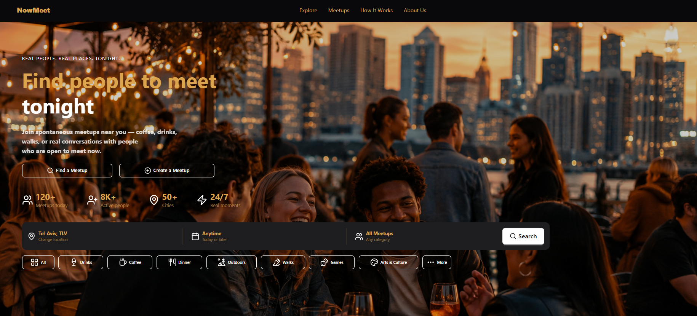

#  NowMeet

**NowMeet** is a modern social meetup platform that helps people discover events, connect with like-minded individuals, and build real-world friendships.

Users can create events, join meetups, chat in real-time, receive AI-powered venue recommendations, and get matched with like-minded people.

🌐 **Live Demo:** [nowmeet.izegov.dev](https://nowmeet.izegov.dev)

---

##  Features

###  Authentication
- Register & Login
- JWT Authentication
- Email Verification
- Forgot / Reset Password
- Protected Routes

###  User Profiles
- Edit Profile
- Upload Avatar
- Personal Information
- About Section
- Interests Management

###  Events
- Create, Edit, Delete Events
- Event Preview
- Upload Cover Images
- Interactive Map (Leaflet)
- Google Geocoding
- Event Capacity & Duration
- Categories & Interests

###  AI Features
- AI Venue Recommendation (Google Places + OpenAI)
- AI Matchmaking
- Personalized Event Recommendations

###  Communication
- Real-time Event Chat
- Private Messaging
- Message History
- Real-time Notifications

###  Community
- Join / Leave Events
- Event Participants
- User Discovery
- Shared Interests

---

##  Tech Stack

### Frontend
- React + Vite
- Redux Toolkit
- React Router
- Tailwind CSS + DaisyUI
- Axios
- Socket.IO Client
- Leaflet
- Lucide React

### Backend
- Node.js + Express.js
- PostgreSQL + Knex.js
- JWT
- Multer + Sharp
- Socket.IO
- Nodemailer
- OpenAI API
- Google Places API
- Google Geocoding API

### Infrastructure
- AWS EC2 (Ubuntu 24.04, eu-north-1)
- Docker + Docker Compose
- Nginx
- GitHub Actions CI/CD
- Let's Encrypt SSL

---

##  Screenshots

### Home Page

---

##  Author

**Roman Izegov**
[GitHub](https://github.com/Romaizega)
[LinkeDin](https://www.linkedin.com/in/roman-izegov/)
